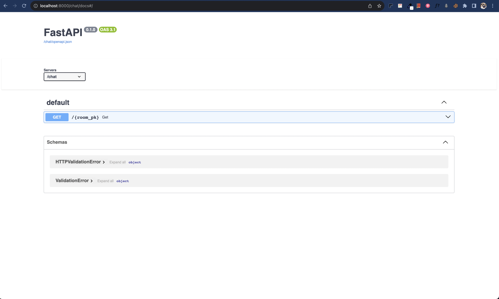

# Alexandria
> 23.9.9 ~ 23.9.13

`Alexandria`는 도서관을 모방하여 만들어진 LLM 플랫폼입니다. 

크게 `Book`과 `Room`으로 관리되며, Book은 도서관의 책이고 Room은 책의 묶음이라 생각할 수 있습니다.
이를 통해 여러권의 책들을 충돌시켜 정보를 취합할 수 있습니다.

- use case
    - 개발자 이력서 + Job offer 설명서 + K8s doc = k8s에 대한 세부적인 면접질문
    - 약품 데이터 + 의료 논문 + 질병 db = 질병 상담
    - 성경 + 불교서적 + 천부경 + 쇼펜하우어 ... = 종교/철학 상담


다음은 서비스 데모 영상입니다.

- https://youtu.be/hrs-yMIUJBw


## 1. Requirements

- Deploy
    - [x] `Docker compose` (v2.4.1)
    - [x] Load balancer, `Nginx`
    - [x] REST 서버 및 WS 서버, `fastapi`
    - [x] CI, Makefile
    - ~~[ ] Pre-commit~~
- LLM
    - [x] Prompt 기반, `Langchain`
    - [x] Model 기반, `Huggingface`
        - Summarization
        - Translation
- API
    - [x] /chat 엔드포인트
    - [x] /chat memory
    - ~~[ ] RLHF pipeline~~
    - [x] Swagger
    - [x] Database, `redis`
- Test
    - [x] Unit test, `Pytest`
    - [x] Load test, `Locust`
        - [x] api test
        - [x] wss test
- Etc
    - [x] DB 또는 vectorstore 어드민, `RedisInsight`
    - [x] 웹소켓 기반 채팅방 구현
    - [x] Langchain component async 작업


## 2. Description


### 2-1. DB / Redis
> [redis 구현체](https://github.com/minkj1992/Alexandria/tree/main/chat/src/infra/redis)

Redis에 저장되고 있는 데이터는 총 5가지입니다.

- `Vectorstore`, 1:1 = Book : Vectorstore
- `Schema`: Vectorstore의 index schema
- `Memory`: Room에서의 채팅 메모리
- `Book`, 1:N = Room : Book
- `Room`

`Vectorstore`는 Book 생성시, Url의 데이터들을 벡터화하여 redis에 저장합니다.

`Schema`는 `Vectorstore`에 저장할 때, 데이터들의 메타데이터에 따라서 동적으로 `Index Schema`를 저장합니다.

`Memory`는 Room에서의 유저와의 대화 기록을 저장하기 위해 사용됩니다.

`Book`은 `Vectorstore`의 메타데이터들을 저장하고, 메타데이터들은 langchain Agent에서 상황에 필요한 vectorstore를 참조하기 위해 사용됩니다.

`Room`은 채팅방을 위해 사용되며, 필요한 Book들을 aggregate할 수 있습니다. 또한 Agent의 system prompt를 저장합니다.


### 2-2. LLM / ML

- [agent](https://github.com/minkj1992/Alexandria/blob/main/chat/src/infra/langchain/agent.py)

유저의 입력에 따라, NLP task를 routing 시키기 위하여 openai function을 사용해서 라우팅하도록 [`OpenAIFunctionsAgent`](https://python.langchain.com/docs/modules/agents/agent_types/openai_functions_agent)를 사용하였습니다.

- [tool](https://github.com/minkj1992/Alexandria/blob/81357e1cd9a410cc7ef0fc1d613fea243074684d/chat/src/infra/langchain/tools.py#L59)
이때 function의 parameter들로 [`Tool`](https://python.langchain.com/docs/modules/agents/tools/)들을 만들어 전달하였습니다. 이때 Huggingface의 모델들 또한 pipeline으로 만든 뒤, `BaseTool`로 구현하여 Tool로 전달해주었습니다.


- [DynamicTool](https://github.com/minkj1992/Alexandria/blob/81357e1cd9a410cc7ef0fc1d613fea243074684d/chat/src/infra/langchain/tools.py#L36)
또한 Room에 저장된 모든 Book들의 Vectorstore들을 동적으로 가져와 Tool로 변경하도록 하였습니다.

사용된 Tool들을 정리하면 다음과 같습니다.

Huggingface
- [t5-small](https://huggingface.co/t5-small)
- [bart-large-cnn](https://huggingface.co/facebook/bart-large-cnn)

Langchain
- Room에 포함된 모든 Book의 Vectorstore들
- 구글 검색을 위한 [Google serper](https://python.langchain.com/docs/integrations/tools/google_serper)


### 2-3. API 


- http://localhost:8000/docs
- http://localhost:8000/chat/docs

<table width="100%" border="0">
  <tr>
    <td></td>
    <td></td>
  </tr>
</table>


### 2-4. Directory 

디렉토리는 간단하게 4가지로 분류했습니다. 일일히 dto를 짜기에 시간이 부족하여 service 레이어를 두었습니다.

- `app/` : fastapi 앱과 관련 기능 코드
- `domain/`: loosly하게 dependency 없는 도메인관련 코드
- `services/`: 여러 infra, model 접근이 필요한 코드
- `infra/`: 외부 의존성 강한 코드들

- [volume](https://github.com/minkj1992/Alexandria/blob/81357e1cd9a410cc7ef0fc1d613fea243074684d/docker-compose.yml#L19)

* huggingface 모델을 `from_pretrained()` 사용하기 위해, chat/models에 저장해 두었고, 이는 mount 되어있습니다.


```
.
├── Makefile
├── README.md
├── chat
│   ├── Dockerfile
│   ├── Makefile
│   ├── README.md
│   ├── env.example
│   ├── models
│   │   ├── bart-large-cnn
│   │   │   ├── config.json
│   │   │   ├── generation_config.json
│   │   │   ├── generation_config_for_summarization.json
│   │   │   ├── merges.txt
│   │   │   ├── pytorch_model.bin
│   │   │   ├── tokenizer.json
│   │   │   └── vocab.json
│   │   └── t5-small
│   │       ├── config.json
│   │       ├── generation_config.json
│   │       ├── pytorch_model.bin
│   │       ├── spiece.model
│   │       ├── tokenizer.json
│   │       └── tokenizer_config.json
│   ├── pyproject.toml
│   ├── src
│   │   ├── app
│   │   │   ├── exceptions.py
│   │   │   ├── handlers.py
│   │   │   ├── http
│   │   │   └── wss
│   │   ├── config.py
│   │   ├── domain
│   │   │   ├── consts.py
│   │   │   ├── models.py
│   │   │   └── prompts.py
│   │   ├── infra
│   │   │   ├── huggingface
│   │   │   │   └── loader.py
│   │   │   ├── langchain
│   │   │   │   ├── agent.py
│   │   │   │   ├── callbacks.py
│   │   │   │   ├── embeddings.py
│   │   │   │   ├── loader.py
│   │   │   │   ├── memory.py
│   │   │   │   ├── tools.py
│   │   │   │   └── vectorstore.py
│   │   │   └── redis
│   │   │       ├── connection.py
│   │   │       └── models.py
│   │   ├── main.py
│   │   ├── services
│   │   │   ├── book_service.py
│   │   │   └── room_service.py
│   │   └── templates
│   │       └── chat.html
│   └── tests
│       ├── locust
│       │   ├── Dockerfile
│       │   └── locustfile.py
│       └── pytest
│           ├── conftest.py
│           ├── test_api
│           ├── test_db
│           └── test_infra
├── docker-compose.test.yml
├── docker-compose.yml
└── nginx
    ├── app.conf
    └── nginx.conf
```


## Run


1. huggingface 모델 다운로드
  - `/chat/models/bart-large-cnn/*`
  - `/chat/models/t5-small/*`

```
python download_model.py
```

2. .env 생성, openai_api_key 추가

```sh
make init

OPENAI_API_KEY 추가
```

3. docker compose 실행
```sh
$ make up
```

4. book 생성
```sh
# about wrtn
curl -X 'POST' \
  'http://localhost:8000/books/urls' \
  -H 'accept: application/json' \
  -H 'Content-Type: application/json' \
  -d '{
  "name": "wrtn",
  "urls": [
    "https://blog.naver.com/wrtntechnologies",
    "https://wrtn.io/",
    "https://wrtn.career.greetinghr.com/"
  ],
  "description": "Useful to know about Wrtn company",
  "max_depth": 3
}'

{
  "book_ulid": "..."
}

# about minwook
$ curl -X 'POST' \
  'http://localhost:8000/books/urls' \
  -H 'accept: application/json' \
  -H 'Content-Type: application/json' \
  -d '{
  "name": "wrtn",
  "urls": [
    "https://github.com/minkj1992/jarvis/issues/16",
    "https://minkj1992.github.io/about/",
    "https://minkj1992.github.io/2022_first_half/"
  ],
  "description": "Useful to know about minwook je",
  "max_depth": 2
}'

{
  "book_ulid": "01HA7CMFW225PBJV2VDSFYFYTW"
}

```

5. room 생성, book_ulid를 books에 넣어주면 됩니다.
```sh
$ curl -X 'POST' \
  'http://localhost:8000/rooms/' \
  -H 'accept: application/json' \
  -H 'Content-Type: application/json' \
  -d '{
  "name": "minwook_wrtn",
  "books": [
    "01HA7CMFW225PBJV2VDSFYFYTW",
    "BOOK_ULID2",
  ],
  "prompt": "Assistant is a large language model trained by OpenAI.\n\nAssistant is designed to be able to assist with a wide range of tasks, from answering simple questions to providing in-depth explanations and discussions on a wide range of topics. As a language model, Assistant is able to generate human-like text based on the input it receives, allowing it to engage in natural-sounding conversations and provide responses that are coherent and relevant to the topic at hand.\n\nAssistant is constantly learning and improving, and its capabilities are constantly evolving. It is able to process and understand large amounts of text, and can use this knowledge to provide accurate and informative responses to a wide range of questions. Additionally, Assistant is able to generate its own text based on the input it receives, allowing it to engage in discussions and provide explanations and descriptions on a wide range of topics.\n\nOverall, Assistant is a powerful system that can help with a wide range of tasks and provide valuable insights and information on a wide range of topics. Whether you need help with a specific question or just want to have a conversation about a particular topic, Assistant is here to assist.\n"
}'

{
  "room_pk": "string"
}
```

6. 채팅, http://localhost:8000/chat/{ROOM_PK}
7. Redis 확인, http://localhost:6380/
8. 종료

```sh
$ make down
```

## Test

1. huggingface 모델 다운로드
  - `/chat/models/bart-large-cnn/*`
  - `/chat/models/t5-small/*`

```sh
python download_model.py
```

2. .env 생성, openai_api_key 추가

```sh
make init-test

OPENAI_API_KEY 추가
```

3. unit 테스트 실행

```sh
$ make test-unit
```

4. load test 실행
```sh
$ make test-load
```
5. http://localhost:8089/ 이동, 3종류 user class 선택하여 테스트


- [locust/](https://github.com/minkj1992/Alexandria/tree/main/chat/tests/locust)


<center>


</center>


6. 종료

```sh
$ make test-down
```
## Improvement

- Auto RLHF system
  - Background Sentiment analysis by NLP model, 유저의 채팅 답변을 기반으로 자동으로 scoring
  - Send feedback api, UI상에서 유저의 input을 받아 scoring
  - 라벨링된 데이터들을 사용해 agent 학습
- Huggingface model Autoscaling (Bottle neck happened)
